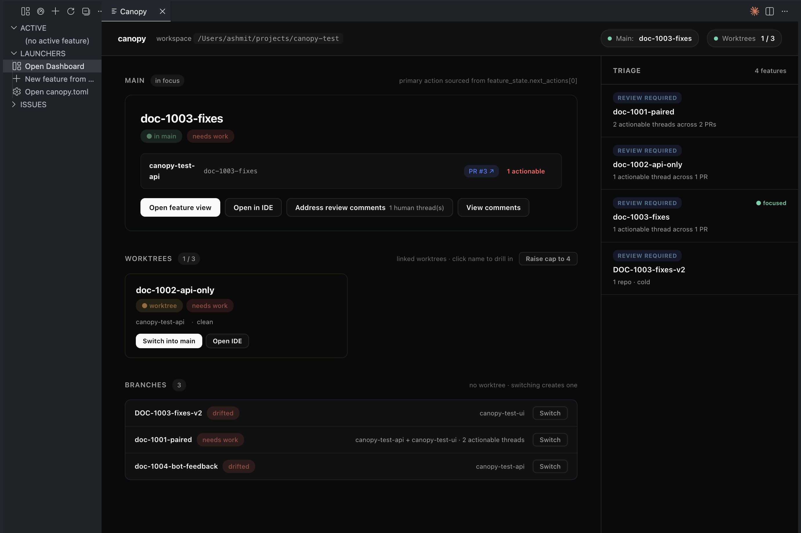
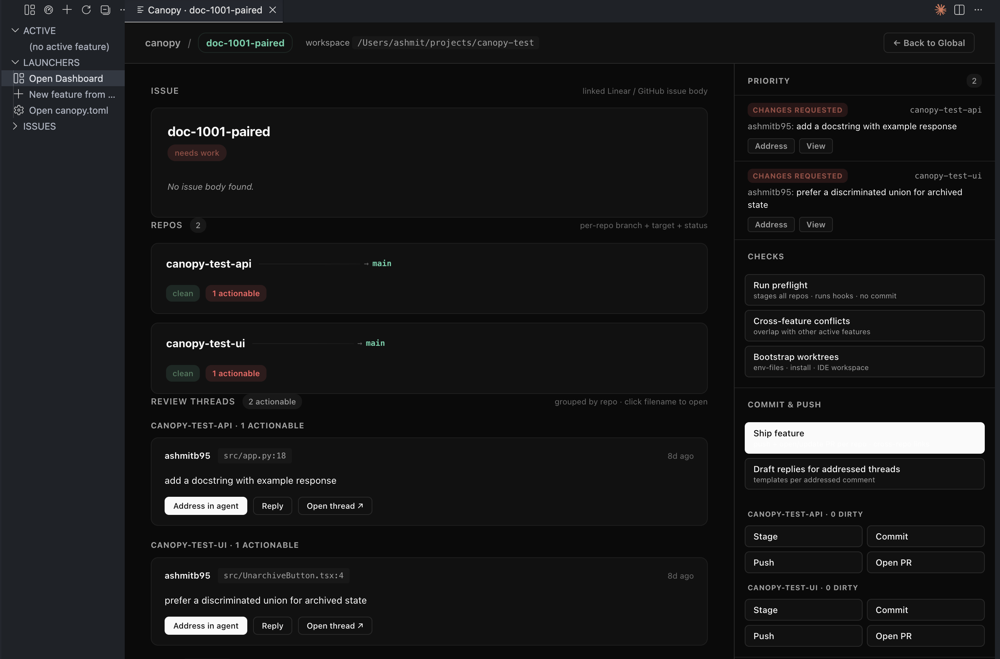

# Canopy — Multi-Repo Worktree Manager

**A switch-first dashboard for multi-repo workspaces. One canonical feature in focus, the rest hibernating in worktrees, every PR / preflight / draft reply one click away.**

Canopy coordinates real Git branches and worktrees across multiple repositories — no proprietary abstractions, no virtual branches. This extension is a VSCode-native surface on top of the [Canopy CLI](https://github.com/ashmitb95/canopy); the same JSON contract the CLI ships. What the dashboard shows is exactly what `canopy state` / `canopy triage` / `canopy feature status` would show in a terminal.

---

## What it does

### One panel, two modes — global and per-feature

Global mode is the focus board. Three vertical lanes mirror Canopy's canonical-slot model: the **canonical** feature (what's currently in your main checkout), **warm** features (linked worktrees, instantly switchable), and **cold** features (branch-only, switching creates a worktree on demand). A right-hand triage rail surfaces the priority list across every PR — changes-requested, bot reviews, review-required, approved.

Click any feature to drill in. The feature view stacks: linked Linear/GitHub issue body → per-repo cards with branch + target + dirty + PR + actionable threads + CI chips → temporally classified review threads grouped by repo (each with **Address in agent** / **Reply** / **Mark addressed** for bot threads) → unified-diff stack with click-to-open in VSCode's native diff viewer. The right rail is the action drawer: Priority list of actionable threads, Checks (preflight + cross-feature conflicts + worktree bootstrap), Commit & push (per-repo Stage / Commit / Push / Open PR + the **Ship feature** capstone + draft-replies generator), State (stash / pop / back to global), Open (IDE / issue / PRs).

### `switch` is the wedge

Clicking a warm feature's **Switch into main** evacuates the current canonical to a warm worktree (instant to switch back) and promotes the clicked feature into the main checkout. Cold features auto-create a worktree; if you're at cap, the LRU warm worktree gets evicted (the button label tells you which one). The "Raise cap" affordance is permanent in the Worktrees section header — no modals, no interruptions.

### Progressive cache, every section streams

Each fetch (`feature_state`, `feature_status`, `feature_diff`, `review_comments`, `bot_status`, issue body) writes to a module-level cache and posts its own UI patch as soon as it returns. Re-clicking a feature you've seen before is essentially instant — the cache survives panel disposal. File-watchers on `.canopy/state/*.json` and `.canopy/features.json` revalidate silently, sections updating in place without skeleton flash. Skeletons appear only inline where async data is genuinely missing, not as full-page silhouettes.

### Sidebar trimmed to launchers + active + issues

Three sections: **ACTIVE** (canonical feature, expandable per-repo), **LAUNCHERS** (Open Dashboard, New Feature from Issue, Open canopy.toml), **ISSUES** (Linear / GitHub Issues inbox). The dashboard owns the rest.

---

## Install

1. Install the extension from the VSCode Marketplace (or `code --install-extension canopy-x.y.z.vsix` for a local build).
2. Open a folder containing a `canopy.toml`. The first time you click the activity-bar canopy icon the dashboard auto-opens; this is per-user, not per-workspace.
3. If the sidebar offers **Install Canopy for me**, click it — the extension sets up a managed venv at `~/.canopy-vscode/venv` and installs the Canopy backend. Otherwise `pipx install canopy` from a terminal works.

The extension shells out to two binaries: `canopy` (the CLI) for the dashboard, and `canopy-mcp` (the MCP server) for the legacy panels + status bar. Both are auto-discovered via login-shell PATH; absolute paths in settings override.

---

## Settings

| Setting | Default | What it does |
| --- | --- | --- |
| `canopy.cliPath` | `canopy` | Path to the `canopy` CLI used by the dashboard. Set absolute if auto-detection fails. |
| `canopy.canopyMcpPath` | `canopy-mcp` | Path to the `canopy-mcp` executable used by the sidebar + status bar. |
| `canopy.dashboard.theme` | `minimal` | `minimal` (near-monochrome dark, default), `pastel` (soft blue-grey cream surfaces), `navy` (legacy). Live-updates on change. |
| `canopy.refreshIntervalSeconds` | `30` | How often to poll Canopy for updated sidebar state. `0` disables periodic refresh. |
| `canopy.pythonPath` | *(empty)* | Optional Python 3.10+ binary used by *Install Backend*. Leave empty to auto-detect. |

---

## Commands (palette via `Cmd-Shift-P`)

| Command | What it does |
| --- | --- |
| `Canopy: Open Dashboard` | Opens the new pastel dashboard. The activity-bar tree's title bar has the same shortcut. |
| `Canopy: Switch to Feature` | Quick-pick feature → promote to canonical slot. |
| `Canopy: Run Preflight` | Stages all repos in the canonical feature + runs hooks (no commit). |
| `Canopy: Sync All Repos` | `git pull --rebase` per repo. |
| `Canopy: Spin up a new feature from Linear` | Picks an open Linear / GH issue → creates branches + worktrees. |
| `Canopy: Mark Feature Done` | Archives a feature: removes worktrees, deletes branches. |
| `Canopy: Open Feature Worktrees in New Window` | One VSCode window per repo worktree for the chosen feature. |
| `Canopy: Run Doctor` | 17-category diagnostic + `--fix` for auto-repairable. |
| `Canopy: Force Reinit Workspace` | Rescan repos + regenerate canopy.toml. |
| `Canopy: Connect Linear` | Drops a Linear MCP entry into `.canopy/mcps.json`. |

The action drawer in feature view exposes: **Run preflight**, **Cross-feature conflicts**, **Bootstrap worktrees** (env files + `install_cmd` + `.code-workspace`), per-repo **Stage / Commit / Push / Open PR**, **Ship feature** (commits + push + opens/updates one PR per repo with cross-repo body links), **Draft replies for addressed threads**, **Stash / Pop**, **Back to global**.

---

## Links

- **[Canopy on GitHub](https://github.com/ashmitb95/canopy)** — CLI, MCP server, full architecture docs
- **[Changelog](CHANGELOG.md)**
- **[Report a bug](https://github.com/ashmitb95/canopy/issues)**

MIT licensed.
